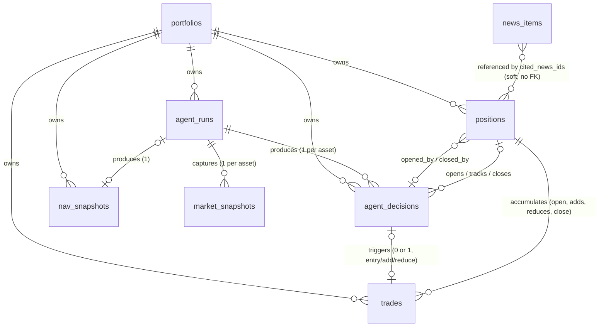

# Database Schema — Trading Data & Entity Logic

**Generated 2026-09-24, pulled directly from the live Postgres schema** (`information_schema` + `pg_constraint` + `pg_indexes`) — not reconstructed from migration files by hand, so this reflects exactly what's deployed, including every column added this session. Re-verify against a live query before trusting this in a future session; schema drifts, this file doesn't automatically.

10 tables total: `portfolios`, `positions`, `trades`, `agent_runs`, `agent_decisions`, `agent_settings`, `market_snapshots`, `market_quotes`, `nav_snapshots`, `news_items`. Focus here is the **trading data** — `positions`, `trades`, `agent_decisions`, `agent_runs`, `nav_snapshots` — with the config/context tables covered more briefly.

---

## 1. Entity relationships

**Not a strict FK everywhere** — `agent_decisions.cited_news_ids` is a plain `uuid[]` with no foreign key into `news_items` (a decision can legitimately outlive the news it cited; the array is an audit trail, not a live join target). `market_quotes` and `agent_settings` are singleton/keyed-by-asset config tables with no relationship to the trading tables at all — they're read, never joined.

---

## 2. `portfolios` — the root entity

One row per portfolio (currently exactly one, `singleton`-style in practice though not DB-enforced the way `agent_settings` is).

| Column | Type | Null? | Default | Logic |
|---|---|---|---|---|
| `id` | uuid | no | `gen_random_uuid()` | PK, referenced by every other trading table |
| `name` | text | no | | |
| `starting_capital` | numeric | no | | `CHECK > 0` |
| `cash` | numeric | no | | **The single source of truth for available cash.** `CHECK >= 0` — never allowed to go negative, which is exactly what `affordableNotionalUsd` (the risk gate's sizing function) exists to prevent before a trade is ever proposed. Every trade updates this via a fresh `cash = cash + net_cash_delta` read-modify-write inside the same atomic RPC transaction that inserts the trade row — never computed by the caller and trusted. |
| `created_at` / `updated_at` | timestamptz | no | `now()` | |

`Cascade` on delete from every child table (`positions`, `trades`, `agent_runs`, `agent_decisions`, `nav_snapshots` all `ON DELETE CASCADE FOREIGN KEY (portfolio_id)`).

---

## 3. `positions` — the core trading-state table

**One row = one FLAT→OPEN→CLOSED lifecycle for one asset.** No lots, no pyramiding — enforced by `positions_one_open_per_asset_idx`, a **partial unique index** on `(portfolio_id, asset) WHERE status = 'open'`: Postgres itself refuses a second open row for the same asset, not just application logic.

| Column | Type | Null? | Default | Logic |
|---|---|---|---|---|
| `id` | uuid | no | `gen_random_uuid()` | |
| `portfolio_id` | uuid | no | | FK → `portfolios`, cascade delete |
| `asset` | text | no | | `'BTC'` / `'ETH'` |
| `direction` | text | no | | `CHECK IN ('long','short')` |
| `quantity` | numeric | no | | `CHECK > 0` — a position can never be recorded at zero or negative size; a full exit is a status change (`open`→`closed`), not a zero-quantity row |
| `entry_price` | numeric | no | | `CHECK > 0`. **The CURRENT weighted-average entry** — mutated in place by `addToPosition` (`newEntryPrice = newCostBasis / newQuantity`, a true weighted average), never by `reducePosition` (a partial exit never moves the average) |
| `cost_basis` | numeric | no | | `CHECK > 0` (implicit via `entry_price`/`quantity` invariant: `cost_basis = entry_price × quantity` holds by construction across every mutation) |
| `status` | text | no | `'open'` | `CHECK IN ('open','closed')` |
| `opened_at` | timestamptz | no | `now()` | |
| `closed_at` | timestamptz | yes | | Paired with `realized_pnl`/`close_reason` — see `positions_closed_fields` below |
| `realized_pnl` | numeric | yes | | **The FINAL close's P&L only** — never touched by an ADD or a partial REDUCE. For the full lifetime P&L across open→add→reduce→close, sum `trades.realized_pnl` for the position instead (below) |
| `opened_by_decision_id` / `closed_by_decision_id` | uuid | yes | | FK → `agent_decisions`, `ON DELETE SET NULL` (a decision can be deleted without invalidating position history) |
| `stop_loss_price` / `take_profit_price` | numeric | no | | **CURRENT, live protection** — the levels `position-monitor` actually checks every tick. Absolute prices, computed by deterministic code from a proposed *percentage* distance — never trusted as an absolute value directly from the model |
| `close_reason` | text | yes | | `CHECK IN ('agent_close','stop_loss','take_profit','collateral_exhausted','profit_giveback')` — mirrors `trades.trigger_reason` for the trade that closed this position. `profit_giveback` is the newest (2026-09-23), the monitor's own giveback ratchet |

**Field-presence invariant** (`positions_closed_fields`, a single CHECK spanning 4 columns): `status='open'` requires `closed_at`/`realized_pnl`/`close_reason` all NULL; `status='closed'` requires all three NOT NULL. No half-closed state is representable.

**Ordering invariant** (`positions_sl_tp_ordering_valid`): for a long, `stop_loss_price < entry_price < take_profit_price`, no exceptions. For a short, `take_profit_price < entry_price < stop_loss_price < entry_price × 2` — the `× 2` ceiling is the collateral-exhaustion price for a 1x-unleveraged synthetic short; a short's stop can never be set at or past the point where the paper collateral is fully consumed. **This single constraint is why a profit-locking stop above entry is structurally impossible** — a real design constraint the giveback ratchet below had to work around rather than violate.

### The immutable R-ruler (added 2026-09-23, Aggressive V3.1)

| Column | Type | Null? | Default | Logic |
|---|---|---|---|---|
| `initial_entry_price` | numeric | yes | | `CHECK > 0` if set. Entry price **at original open only** — never updated by ADD or REDUCE, unlike `entry_price` above |
| `initial_stop_loss_price` | numeric | yes | | `CHECK > 0` if set. Stop **at original open only** — never updated by ADD, REDUCE, or deterministic tightening |
| `initial_risk_usd` | numeric | yes | | `CHECK >= 0` if set. `quantity₀ × |entry₀ − stop₀|` at origination, frozen forever |

Together these three form **one immutable denominator unit** — `riskPerUnit₀ = |initial_entry_price − initial_stop_loss_price|` — that two R-metrics get computed against (`priceR` = market-path distance from `initial_entry_price`; `positionPnlR` = economic P&L ÷ `initial_risk_usd`). Set atomically inside `open_position_atomic` for every new position (both Balanced and Aggressive — Balanced simply never reads them). All three are `NULL` for any position opened before 2026-09-23 **unless** the one-time guarded backfill applied to it (only positions with zero recorded protection changes were backfilled — see §8).

### Resize-neutral P&L and high-water state (same migration)

| Column | Type | Null? | Default | Logic |
|---|---|---|---|---|
| `partial_realized_pnl_usd` | numeric | **no** | `0` | Cumulative P&L from every REDUCE on this position's life, **NET of the fee each reduce actually paid** (slippage is already embedded via `fillPrice`; only fee needed subtracting — a pre-deploy review catch). Deliberately **not** the same figure as `realized_pnl` above, which stays gross — this is the number that gets added into `positionPnlR`'s numerator, so a sunk cost must reduce it or repeated REDUCEs would silently overstate protected profit |
| `sampled_mfe_r` | numeric | yes | | Running **maximum** of `positionPnlR` over the position's life, sampled once per position-monitor tick. `NULL` until tracking starts. Drives the giveback ratchet |
| `sampled_mae_r` | numeric | yes | | Running **minimum**, same sampling. Analytics only — the ratchet never keys on this |
| `peak_total_pnl_usd` | numeric | yes | | USD-denominated peak of `(unrealizedPnlUsd + partial_realized_pnl_usd)` — quantity-dependent, so **not** comparable across an ADD/REDUCE boundary the way the R-metrics are |
| `peak_pnl_at` | timestamptz | yes | | When the peak above was last raised — lets analysis compute `time_from_peak_to_current` |
| `giveback_floor_r` | numeric | yes | | `CHECK > 0` if set. The armed ratchet floor, in `positionPnlR` units. **Monotone by construction** — `nextGivebackFloor` in code only ever raises it, and `positions_sampled_mfe_mae_ordering`/no-decrease is additionally enforced at the ratchet-logic layer (not the DB — the DB only checks `sampled_mfe_r >= sampled_mae_r`, a sanity bound, not the monotonicity itself) |
| `high_water_tracked_from` | timestamptz | yes | | `CHECK >= opened_at` if set. **NULL = "never tracked," the sole eligibility gate for the giveback mechanism.** Set to `opened_at` atomically for every position opened 2026-09-23 onward; deliberately left NULL for every guard-backfilled legacy position, since their true historical peak predates any tracking and starting fresh now would understate MFE |

---

## 4. `trades` — the immutable execution ledger

**One row per actual fill.** Unlike `positions` (mutated in place across a lifecycle), `trades` is append-only — every OPEN, ADD, REDUCE, and CLOSE gets its own permanent row, so a position's full history is reconstructable by asking "every trade with this `position_id`, in order."

| Column | Type | Null? | Default | Logic |
|---|---|---|---|---|
| `id` | uuid | no | `gen_random_uuid()` | |
| `portfolio_id` | uuid | no | | FK, cascade delete |
| `decision_id` | uuid | yes | | FK → `agent_decisions`, cascade delete. **NULL for an automatic exit** (stop-loss/take-profit/collateral-exhausted/profit-giveback), set for anything agent-initiated |
| `position_id` | uuid | no | | FK → `positions`, `ON DELETE SET NULL` |
| `asset` | text | no | | |
| `side` | text | no | | `CHECK IN ('BUY','SELL')` — the mechanical fill direction, independent of `intent` below (a `CLOSE_LONG` is a `SELL`; a `CLOSE_SHORT` is a `BUY`) |
| `quantity` | numeric | no | | `CHECK > 0` |
| `reference_price` | numeric | no | | `CHECK > 0`. Market price **before** simulated slippage |
| `fill_price` | numeric | no | | `CHECK > 0`. What the paper broker actually filled at, after slippage |
| `fee` | numeric | no | | `CHECK >= 0` |
| `slippage_cost` | numeric | no | | `CHECK >= 0` |
| `gross_value` | numeric | no | | `quantity × fill_price` |
| `net_cash_delta` | numeric | no | | Signed — what actually got added to/subtracted from `portfolios.cash` |
| `cash_after` | numeric | no | | `CHECK >= 0`. The portfolio's cash immediately after this trade — a persisted audit value, not re-derived at read time |
| `executed_at` | timestamptz | no | `now()` | |
| `intent` | text | no | | `CHECK IN ('OPEN_LONG','OPEN_SHORT','CLOSE_LONG','CLOSE_SHORT','ADD_LONG','ADD_SHORT','REDUCE_LONG','REDUCE_SHORT')`. **Distinct from `agent_decisions.action`**: `intent` describes the trade mechanically (`CLOSE_LONG` = a long closed via a sell); `action` describes the model's decision (`CLOSE` is direction-agnostic) |
| `trigger_reason` | text | yes | | `CHECK IN ('agent_close','stop_loss','take_profit','collateral_exhausted','profit_giveback')` or NULL |
| `realized_pnl` | numeric | yes | | **NULL for OPEN/ADD** (nothing realized yet); **populated for REDUCE** (the reduced portion only, gross) **and CLOSE** (the full amount). `sum(realized_pnl)` grouped by `position_id` is the trustworthy *lifetime* P&L source across an open→add→reduce→close life — `positions.realized_pnl` only ever captures the final close |

### The provenance invariant (`trades_provenance_valid`) — the single most important CHECK in this schema

Exactly three legal `(intent, decision_id, trigger_reason)` combinations, nothing else representable:

1. `OPEN_*` / `ADD_*` / `REDUCE_*` → `decision_id` **required**, `trigger_reason` **NULL**. Every entry, add, and reduce is agent-initiated by construction — there is no automatic path that opens, adds, or reduces.
2. `CLOSE_*` with `decision_id` set → `trigger_reason` **must be** `'agent_close'`.
3. `CLOSE_*` with `decision_id` **NULL** → `trigger_reason` **must be** one of `stop_loss`/`take_profit`/`collateral_exhausted`/`profit_giveback` — the four ways `position-monitor` can close something entirely on its own.

Two more structural guarantees, both **unique indexes, not just conventions**:
- `trades_decision_unique` — `UNIQUE (decision_id)`: **at most one trade per decision, ever.** A decision that didn't execute (a HOLD, a rejected proposal) simply has no trade row.
- `trades_one_close_per_position_idx` — `UNIQUE (position_id) WHERE intent IN ('CLOSE_LONG','CLOSE_SHORT')`: **a position can be closed exactly once.** This is what makes a partial exit representable as `REDUCE_*` rather than a second close — REDUCE is structurally exempt from this index (only `CLOSE_*` intents are covered), which is precisely what allows more than one REDUCE against the same position.

---

## 5. `agent_runs` — the idempotency and audit anchor for one execution

One row per invocation attempt of either automated loop.

| Column | Type | Null? | Default | Logic |
|---|---|---|---|---|
| `id` | uuid | no | `gen_random_uuid()` | Every `agent_decisions`/`market_snapshots`/`nav_snapshots` row for one cycle shares this one `run_id` |
| `portfolio_id` | uuid | no | | FK, cascade |
| `idempotency_key` | text | no | | **`UNIQUE`** — this is the actual dedup mechanism. Manual: `decision-manual-<ms-precision iso>` (every click gets its own key). Scheduled: `decision-<nowIso floored to decision_interval_minutes>` (a retried/duplicate cron tick collides and is rejected). Monitor: `monitor-<floored to monitor_interval_minutes>` |
| `status` | text | no | | `CHECK IN ('running','completed','skipped','failed')` |
| `skip_reason` | text | yes | | `CHECK`: required whenever `status='skipped'` |
| `error_detail` | text | yes | | |
| `started_at` | timestamptz | no | `now()` | |
| `completed_at` | timestamptz | yes | | Deliberately **not** derived from a shared `nowIso` the way `started_at` can be — always the real completion moment, so duration is measurable |
| `prompt_version` / `model_version` | text | yes | | |
| `kind` | text | no | `'decision'` | `CHECK IN ('decision','monitor')` — two independent `pg_cron` jobs write here (plus manual clicks for `'decision'`) |

**Concurrency invariant** (`agent_runs_one_running_decision_idx`) — `UNIQUE (kind) WHERE status='running' AND kind='decision'`: **at most one decision cycle can be `running` at any instant**, portfolio-wide. This is what actually prevents two overlapping decision cycles, distinct from `idempotency_key`'s uniqueness (which only stops the *same* tick/click from double-executing, not two *different* legitimate triggers from racing).

---

## 6. `agent_decisions` — one row per asset per cycle, always (including HOLD)

**The single largest table by column count (52) — because it's the full audit trail of "what did the strategy propose, what did Jev say, what did the gate allow, what actually executed," for every asset, every cycle, with no exceptions.**

`UNIQUE (run_id, asset)` — exactly one row per asset per run.

### Identity & core proposal

| Column | Logic |
|---|---|
| `id`, `run_id` (FK→`agent_runs`, cascade), `portfolio_id` (FK, cascade), `asset` | |
| `action` | `CHECK IN ('OPEN_LONG','OPEN_SHORT','HOLD','CLOSE','ADD','REDUCE','MODIFY_PROTECTION')` — the FINAL action, after every neutralization/normalization/gate decision has been applied |
| `confidence` | `CHECK [0,1]` |
| `primary_driver` | `CHECK IN ('NEWS','TECHNICAL','BOTH','NONE')` |
| `horizon_hours` | |
| `reasons` / `invalidation` | `jsonb`, both `CHECK jsonb_typeof(...) = 'array'`. `invalidation` specifically: conditions that would falsify the thesis, fed back into the *next* cycle so an open position is exited against its own stated thesis, not a freshly re-derived opinion |
| `cited_news_ids` | `uuid[]`, no FK (see §1) |

### Risk gate outcome

| Column | Logic |
|---|---|
| `risk_status` | `CHECK IN ('approved','rejected','clamped','not_applicable')` |
| `risk_reason` | `CHECK`: required whenever `risk_status IN ('rejected','clamped')` |
| `approved_size_pct` | `CHECK [0,1]` if set |
| `size_cap_applied` | `CHECK IN ('single_trade','asset_exposure','cash','portfolio_risk','total_notional')` or NULL |
| `effective_min_confidence`, `effective_risk_budget_pct`, `effective_single_trade_cap_pct`, `effective_asset_exposure_cap_pct`, `effective_portfolio_risk_ceiling_pct`, `effective_max_total_notional_pct` | **Denormalized onto every decision row, deliberately** — the actual caps/budget in force *at decision time*, so re-tuning `agent_settings` or the strategy-profile tables later never makes a historical row misleading about what rule it was actually evaluated against |

### Model call provenance

| Column | Logic |
|---|---|
| `input_payload` | `jsonb`, **not null** — the exact state sent, always persisted even if no model call happened that cycle |
| `output_payload` | `jsonb`, nullable — null specifically when no model call happened |
| `prompt_version`, `model_version` | `model_version` disambiguates a real call (`'jev-1.13.0'`) from `'call-failed'` (news/API outage) from `'not-called'` (layer disabled or no candidate) |
| `model_vetoed` | boolean, nullable — null means no completed veto verdict this cycle (not "false") |
| `strategy_version` | Free text, no CHECK constraint deliberately — records exactly what generated the row even as the live set of strategies evolves (`'v0-gemini-originated'`, `'v1-regime'`, `'v3-jev-intraday-30m'` all currently appear) |

### Position linkage & protection change

| Column | Logic |
|---|---|
| `position_id` | FK→`positions`, `ON DELETE SET NULL`. The position this decision opened, closed, or (for a HOLD on an open position) is currently tracking — NULL for a HOLD while flat |
| `proposed_stop_loss_pct` / `proposed_take_profit_pct` | `CHECK` strictly positive (and `<1` for SL) if set — only populated for an entry |
| `computed_stop_loss_price` / `computed_take_profit_price` | The gate's own computed absolute prices |
| `proposed_action` / `proposed_action_confidence` | Jev's *raw* management choice, before any normalization — `CHECK` same action enum, confidence `[0,1]` |
| `proposed_adjust_notional` / `executed_adjust_notional` | ADD/REDUCE sizing, both `CHECK >= 0` — proposed is the uncapped figure Jev's magnitude implies, executed is post-gate-cap |
| `stop_loss_price_before/_after`, `take_profit_price_before/_after` | `CHECK > 0` if set — the protection change's before/after snapshot for a MODIFY_PROTECTION row |
| `protection_rejection_reason` | Set when the gate rejected a genuine (not no-op) protection change attempt |

### Aggressive-only economics (all nullable, all null for Balanced)

| Column | Logic |
|---|---|
| `expected_move_pct` | `CHECK >= 0`. Jev's OWN prediction (never the deterministic ATR target), mapped through a pre-registered score table |
| `estimated_round_trip_cost_pct` | `CHECK >= 0`. Deterministic fee+slippage cost as a fraction |
| `move_to_cost_ratio` | `CHECK >= 0`. `expected_move_pct / estimated_round_trip_cost_pct` — separates "Jev was directionally wrong" from "the predicted move never cleared friction" |
| `position_pnl_r` | THE economic profit metric at decision time — `(unrealizedPnlUsd + partial_realized_pnl_usd) / initial_risk_usd` |
| `price_r` | Market-path metric — `(price − initial_entry_price) / riskPerUnit₀`. **Persisted separately from `position_pnl_r` on purpose** — after an ADD at a worse price the two can disagree, and collapsing them into one column would hide exactly that |
| `sampled_mfe_r` | `positions.sampled_mfe_r` as observed at decision time |
| `giveback_r` | `CHECK >= 0`. `max(0, sampled_mfe_r − position_pnl_r)` |
| `minutes_since_entry` | `CHECK >= 0` |
| `action_normalization_reason` | `CHECK IN ('modify_protection_noop_both_intents_keep', 'add_reduce_below_min_notional')` or NULL. **Answers "why does `proposed_action` differ from `action`, when it isn't a plain gate rejection"** — the specific gap a live diagnosis found: Jev choosing `MODIFY_PROTECTION` with both stop/target sub-intents resolving to "no change" was previously indistinguishable from Jev genuinely choosing HOLD |

---

## 7. Config & context tables (brief)

| Table | Purpose | Notable logic |
|---|---|---|
| `agent_settings` | Singleton row (`singleton boolean UNIQUE`, `CHECK singleton IS TRUE` — structurally only one row possible) holding every global knob | `strategy_profile` (`'balanced'/'aggressive'`, `'conservative'` deliberately excluded) is a **separate dial** from `risk_appetite` (`'conservative'/'balanced'/'aggressive'`) — same words, unrelated concepts, explicitly called out in the column comment to prevent conflation |
| `market_snapshots` | One immutable row per asset per decision cycle — indicators + recent closes, the audit trail the strategy and Decision-detail UI read | `UNIQUE (run_id, asset)` |
| `market_quotes` | One row **per asset** (PK is `asset` itself, not a surrogate id) — the extension's own live-price display source, continuously upserted, unrelated to any specific decision | Separate from `market_snapshots` on purpose — one is a live "current price" cache, the other an immutable per-cycle audit record |
| `nav_snapshots` | One row per completed run (both kinds) — portfolio valuation at that moment | `UNIQUE (run_id)`. `realized_pnl_cum` is a running total carried forward from the prior snapshot plus this run's own delta, not recomputed from full trade history every time |
| `news_items` | Deduplicated RSS items | `UNIQUE (external_id)` is the actual cross-lookback-window dedup mechanism; `assets` is a `text[]` with a GIN index for the relevance tagging |
| `portfolios` | Root entity, see §2 | |

---

## 8. How the entities interact — the actual write sequence

**One decision cycle** (`agent-cycle`, whether manual or the 15-minute cron):

1. Insert one `agent_runs` row (`kind='decision'`), guarded by the idempotency-key unique constraint and the one-running-decision partial index.
2. Per asset: read current `positions` (if any), compute a deterministic candidate, insert one `market_snapshots` row.
3. At most one batched Jev call for the whole cycle (never per-asset).
4. Per asset: insert exactly one `agent_decisions` row — **always**, including a HOLD, including a failed model call. This row is the permanent record of "what was decided," independent of whether anything executed.
5. If the decision executes a trade: call the matching **atomic RPC** (`open_position_atomic` / `adjust_position_atomic` / `close_position_atomic` / `modify_protection_atomic`), each of which — inside ONE transaction — mutates `positions`, applies the cash delta to `portfolios` via a fresh read-modify-write, and inserts exactly one `trades` row. `agent_decisions.position_id` is then linked back for a fresh OPEN (it couldn't be known before the position existed).
6. Insert one `nav_snapshots` row, re-reading fresh `positions`/`portfolios.cash` rather than trusting in-memory state (so a lost race is reflected correctly).
7. Mark the `agent_runs` row `completed`.

**One position-monitor tick** (independent, every 10 minutes): reads all `status='open'` positions, replays price points since its last run, checks SL/TP first (via `close_position_atomic`, `decision_id=NULL`), then — for any eligible position (`high_water_tracked_from IS NOT NULL`) that didn't just close — advances the high-water columns with exactly one `positions` `UPDATE`, and executes a `profit_giveback` close (same RPC, with the added quantity guard) only while Aggressive is the active profile.

**The two atomic RPCs' shared discipline**: `close_position_atomic` and `adjust_position_atomic` both use a conditional `UPDATE ... WHERE status='open' [AND quantity=$expected]` inside their own transaction — if another path (the monitor vs. the decision cycle) already mutated the row first, the `UPDATE` matches zero rows, the RPC reports "lost the race," and the caller discards its computed trade rather than double-executing. This is the actual mechanism behind "SL/TP always wins the race" and "a giveback exit never acts on stale economics" — not application-level locking, a database-level conditional write.
